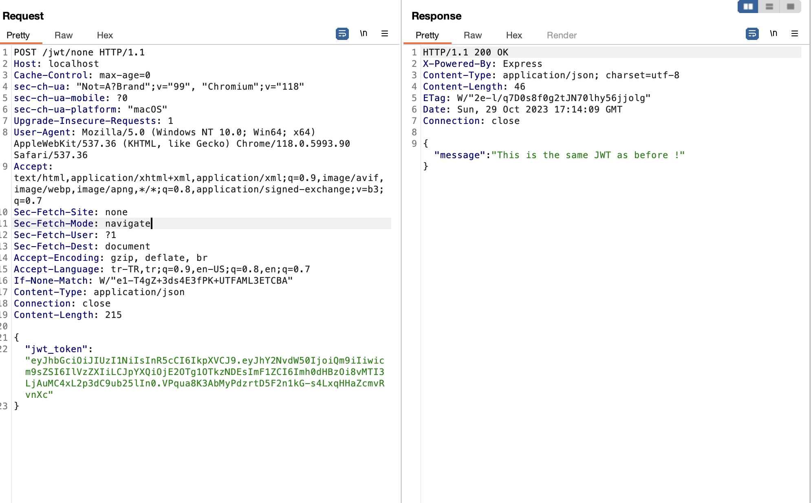

# JWT None Algorithm Attack

- 1)  İlk olarak kullanıcı '/' e gittikten sonra generate edilmiş jwt token gelecek.
- 2) Daha sonra kullanıcı bu jwt tokeni alıp HS256 algoritmasını none a çevirdikten sonra labı çözmüş olacak ve dinamik
generate edilmiş flagi alacak.

- 3) /jwt/none a post request atılacak. Daha sonra dönen response da flag elde edilecek.

# ÖNEMLİ

Token decode edilirken sıkıntı çıkabiliyor

https://token.dev/ bu siteden decode edilmesi iyi olur. None yazılırsa algoritmaya olmaz none olarak küçük bir şekilde yazılacak

Son olarak tokeni bu siteden decode edip algoritmayı none yaptıktan sonra json bodyye koyarken tokenin sonuna bir . koymamız gerekiyor.
Jwt 3 parttan oluştuğu için.